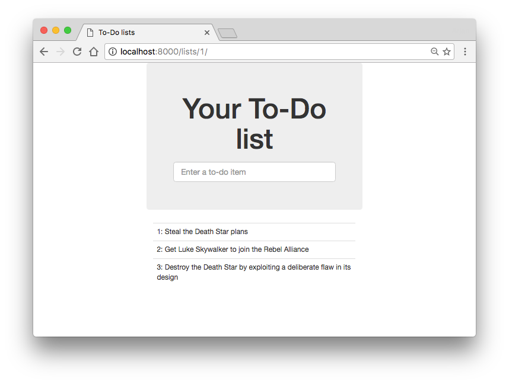

# Test-Driven Development with Python

Author: Arjan Geers (ajgeers@gmail.com)


## About

Django web app for creating to-do lists. It was developed by following along with the first seven chapters of ['Test-Driven Development with Python'](http://www.obeythetestinggoat.com/) (1st edition) by Harry J.W. Percival.




## Instructions

Follow these instructions to get the app up and running on your local machine:

```sh
# Clone repo
git clone https://github.com/ajgeers/tdd-with-python.git
cd tdd-with-python

# Create conda environment
conda env create -n tdd_with_python -f environment.yml
source activate tdd_with_python

# Run app
python manage.py migrate  # create database and apply migrations
python manage.py test  # run functional and unit tests
python manage.py runserver  # start development server
```

Now go to [localhost:8000](http://127.0.0.1:8000/) to view the app.


## License

MIT
